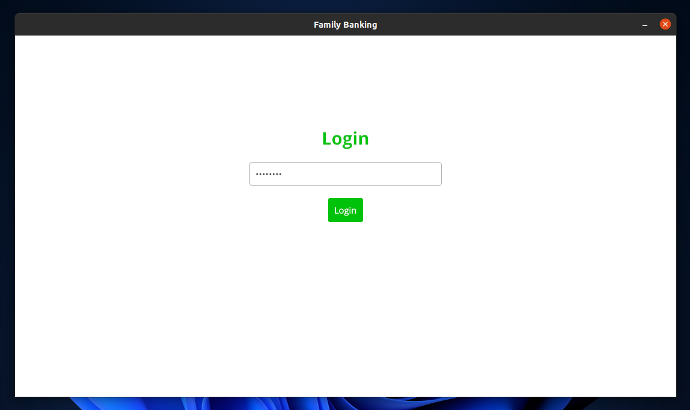
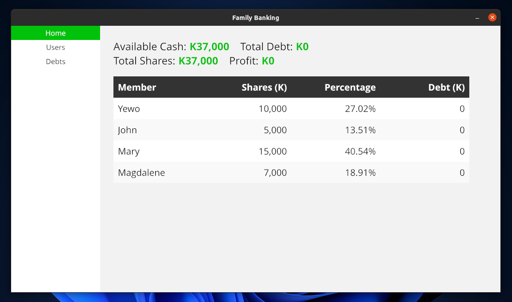
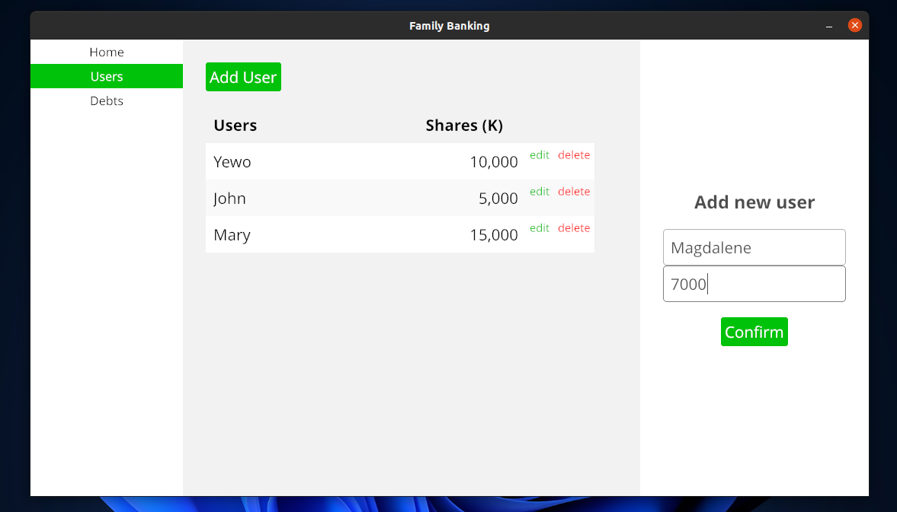
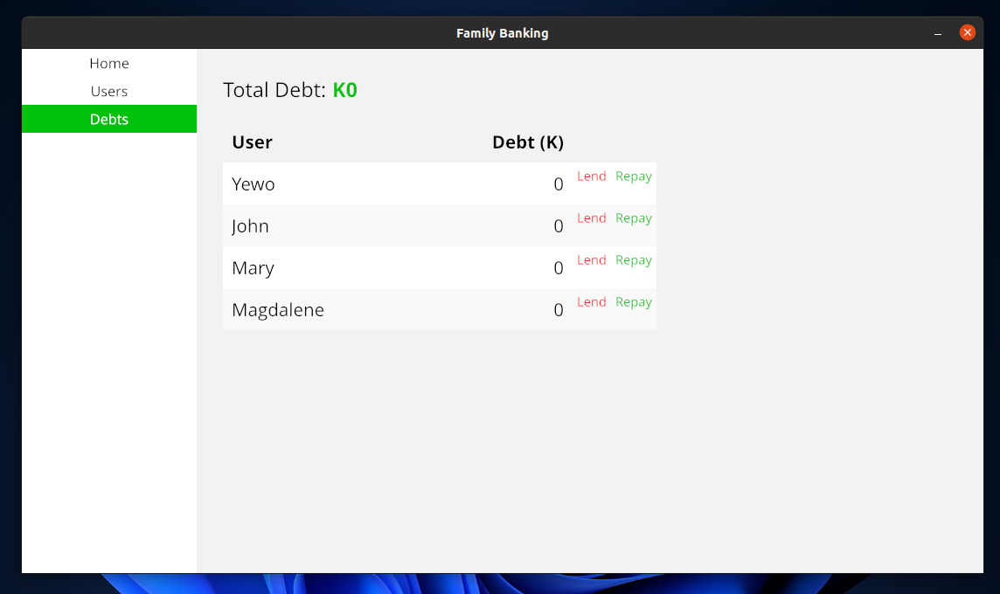

# Family Banking
This app is basically supposed to be used in the setting of communal banking, for record keeping. It is built using the [iced GUI libray](http://github.com/iced-rs/iced) for Rust

# Screenshots

# TODO
- Will probably need to find a way of encrypting the sqlite file